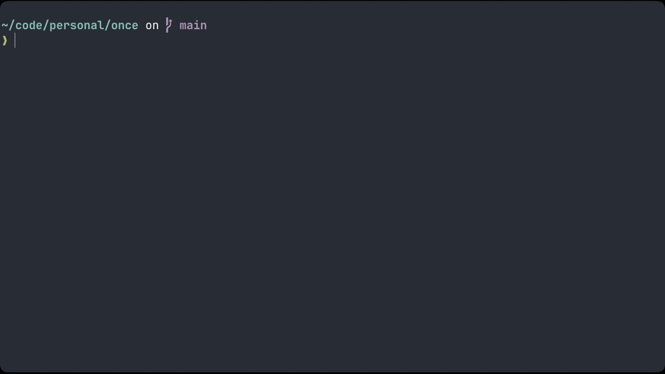

# Once

`once` is a BigConfig package for [ONCE](https://github.com/basecamp/once). This BigConfig package is an infrastructure automation tool that simplifies the provisioning and configuration of cloud resources using [OpenTofu](https://opentofu.org/) and [Ansible](https://www.ansible.com/). The audience is the vibe coder who wants to deploy his vibe coded application with a "one-click" experience.

It is built on top of [big-config](https://github.com/amiorin/big-config), leveraging its workflow and configuration management capabilities.



## Features

- **End-to-End Orchestration**: A seamless six-stage workflow:
  1. **Infrastructure**: Provisioning with OpenTofu.
  2. **SMTP**: Email infrastructure with OpenTofu (Resend).
  3. **DNS**: Domain configuration with OpenTofu (Cloudflare provider v5), including automatic SMTP records, apex (`@`) and wildcard (`*`) A records proxied through Cloudflare, and a curated bundle of zone settings (TLS 1.3, strict SSL, always-use-HTTPS, etc.).
  4. **SMTP Post-Verification**: Finalizing SMTP setup (e.g., domain verification) with OpenTofu.
  5. **Remote Config**: System configuration with Ansible on the remote host (installs Docker and ONCE).
  6. **Local Config**: Finalizing setup with Ansible on the local machine (configures `~/.ssh/config` for easy access).
- **OpenTofu S3 Backend**: Support for remote state management using S3, automatically rendered for all Tofu-based stages.
- **Multi-Cloud Support**: Native templates for:
  - **DigitalOcean** (`digitalocean`)
  - **Hetzner Cloud** (`hcloud`)
  - **Oracle Cloud Infrastructure** (`oci`)
  - **No-Infra** (`no-infra`): For when the server is already there.
- **Dynamic Inventory**: Automatically bridge the gap by generating Ansible inventory directly from OpenTofu outputs.
- **SMTP Testing Ready**: Automatically installs `s-nail` and configures `.mailrc` on the remote host for immediate SMTP verification.
- **Environment Overrides**: Support for overriding any configuration parameter via environment variables (e.g., `BC_PAR_DOMAIN`).
- **Configurable Workflows**: Execute complex multi-step processes like `tofu init/apply` followed by multiple `ansible-playbook` runs.

## Prerequisites

To use `once`, you need the following tools installed:

- **[Clojure](https://clojure.org/guides/install_clojure)**: The core engine.
- **[Babashka](https://babashka.org/)**: Recommended for running CLI tasks.
- **[OpenTofu](https://opentofu.org/docs/intro/install/)**: For infrastructure management.
- **[Ansible](https://docs.ansible.com/ansible/latest/installation_guide/intro_installation.html)**: For configuration management.
- **[AWS CLI](https://docs.aws.amazon.com/cli/latest/userguide/getting-started-install.html)**: Required for S3 backend management.
- **Cloud Credentials**: e.g., `DIGITALOCEAN_TOKEN`, `HCLOUD_TOKEN`, `CLOUDFLARE_API_TOKEN`, `RESEND_API_KEY`, or OCI configuration.

## Usage

### Configuration Overrides

You can override any parameter defined in `options.clj` using environment variables prefixed with `BC_PAR_`. The variable name is converted to lowercase, and underscores or dots are replaced with hyphens.

Example:
```bash
export BC_PAR_DO_TOKEN="your-digitalocean-token"
export BC_PAR_RESEND_PASSWORD="your-smtp-password"
export BC_PAR_DOMAIN="example.com"
```

To enable the S3 backend for OpenTofu, set the following parameters:
```bash
export BC_PAR_PROVIDER_BACKEND="s3"
export BC_PAR_S3_BUCKET="your-tf-state-bucket"
export BC_PAR_S3_REGION="eu-west-1"
```

These will be automatically merged into the workflow parameters.

### Via Babashka (Recommended)

The easiest way to interact with `once` is through the provided Babashka tasks.

#### 1. Setup

Clone the repository and configure your options:

```bash
git clone https://github.com/amiorin/once
cd once
# Edit your chosen provider options
edit src/clj/io/github/amiorin/once/options.clj
```

In `src/clj/io/github/amiorin/once/options.clj`, you can switch the active profile used by Babashka by changing the `bb` definition:

```clojure
;; options.clj
;; Switch between digitalocean, oci, hcloud, no-infra, online, or space
(def bb space)
```

`online` and `space` are application profiles built on top of `oci` — they pin a domain, package, and the list of containerized apps deployed by Ansible (the `space` profile, for example, deploys a templated Pocketbase instance).

Note: If you are using the `no-infra` profile, ensure your parameters are correctly prefixed (e.g., `no-infra-compute-ip`, `no-infra-compute-user`, `no-infra-smtp-server`).

#### 2. Main Workflow

The `once` task handles the full lifecycle. You can pass multiple commands:

- **Full Setup**: `bb once create` (Tofu -> Tofu SMTP -> Tofu DNS -> Tofu SMTP Post -> Ansible -> Ansible Local)
- **Tear Down**: `bb once delete` (Tofu DNS Destroy -> Tofu SMTP Post Destroy -> Tofu SMTP Destroy -> Tofu Destroy)
- **Sequential**: `bb once delete create` (Clean slate redeploy)
- **Profile-targeted**: `bb online create`, `bb space create` (run a specific application profile regardless of the active `bb` var)
- **Parallel**: `bb parallel create` / `bb parallel delete` (runs `online` and `space` concurrently)

Compute resources are rendered with `lifecycle { prevent_destroy = true }` by default as a safeguard. To run `bb once delete`, first override it:

```bash
export BC_PAR_COMPUTE_PREVENT_DESTROY=false
```

#### 3. Targeted Tools

You can also run the underlying tools individually. Most tasks require a `render` step first to generate the necessary config files from templates into the `.dist/` directory.

- **OpenTofu (Infrastructure)**:
  ```bash
  bb tofu render tofu:init tofu:apply:-auto-approve
  ```
- **OpenTofu (SMTP)**:
  ```bash
  bb tofu-smtp render tofu:init tofu:apply:-auto-approve
  ```
- **OpenTofu (DNS)**:
  ```bash
  bb tofu-dns render tofu:init tofu:apply:-auto-approve
  ```
- **OpenTofu (SMTP Post-Verification)**:
  ```bash
  bb tofu-smtp-post render tofu:init tofu:apply:-auto-approve
  ```
- **Remote Ansible**:
  ```bash
  bb ansible render -- ansible-playbook main.yml
  ```
- **Local Ansible**:
  ```bash
  bb ansible-local render -- ansible-playbook main.yml
  ```

### Programmatic Usage

You can trigger workflows directly from a Clojure REPL:

```clojure
(require '[io.github.amiorin.once.package :as once])
(require '[io.github.amiorin.once.options :as options])

;; Run the "create" workflow using OCI profile
(once/once* "create" options/oci)
```

## How It Works

1. **Template Rendering**: `big-config` takes templates from `src/resources` and your options to generate valid Tofu and Ansible files in `.dist/`.
2. **Infrastructure Hook**: When `create` runs, it first executes OpenTofu to provision resources.
3. **Inventory & Config Bridging**: The Tofu output (like the new server IP or SMTP records) is captured using `tofu output --json` and injected into the DNS configuration and Ansible inventory generation logic.
4. **Configuration**: Ansible then connects to the new host using the dynamically generated inventory to apply your playbooks.
5. **Local Finalization**: The local Ansible playbook updates your local environment (e.g., `~/.ssh/config`) so you can immediately SSH into the server using its name.

## Project Structure

- `src/clj/.../once/`:
  - `package.clj`: Defines the high-level `create`/`delete` workflows.
  - `params.clj`: Logic for extracting parameters from Tofu outputs.
  - `tools.clj`: Implementation details for Tofu, Tofu SMTP, Tofu DNS, and Ansible wrappers.
  - `options.clj`: Where you define your cloud profiles and credentials.
- `src/resources/.../once/tools/`:
  - `tofu/`: Multi-cloud `.tf` templates.
  - `tofu-backend/`: OpenTofu backend templates (S3).
  - `tofu-smtp/`: SMTP configuration templates (Resend).
  - `tofu-dns/`: DNS configuration templates (Cloudflare).
  - `tofu-smtp-post/`: SMTP post-verification templates (Resend).
  - `ansible/`: Remote system playbooks.
  - `ansible-local/`: Local machine configuration playbooks.

## Development

If you are contributing to `once`, you can use the following task to keep the code clean:

```bash
bb tidy
```

This uses `clojure-lsp` to clean namespaces and format the source code.

## License

Copyright © 2026 Alberto Miorin

Distributed under the MIT License.
